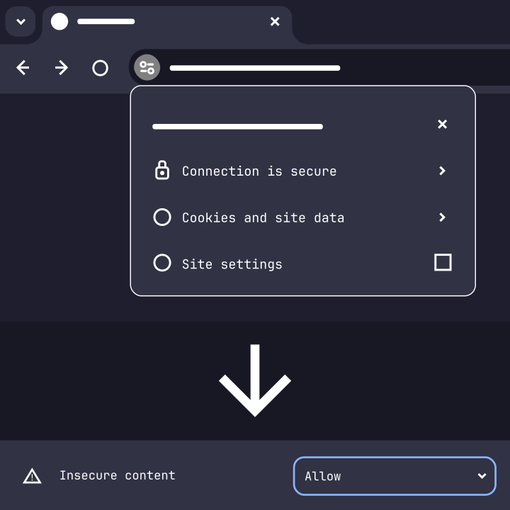

> A simple js library that helps you find devices on your network

Detects:

- CircuitPython boards
- Routers

[Usage example](https://github.com/sensei-alex/scan/blob/main/scan.html)
[Live demo](https://snlx.net/scan/scan.html)

## Security explainer

The traffic on your local network can't (and probably shouldn't) be encrypted.
The connection to most sites is.

This library gets downloaded to your browser and tries to establish regular unencrypted HTTP connections to your other devices.
The browser assumes that if a connection is unencrypted, there can be a third party watching it.
Since this tool is connecting from a device on your local network to another device on your local network, the only way someone could
be watching you is if they were on your local network too. The browser can't know that, so it tries to keep everything between your machine
and the website's (this library's) server. You know that, so this can be safely ignored.

To allow the browser to make unencrypted connections:

- click in the top left corner on the settings icon
- go to Site settings
- Allow Insecure content
- return to the site and click Reload

